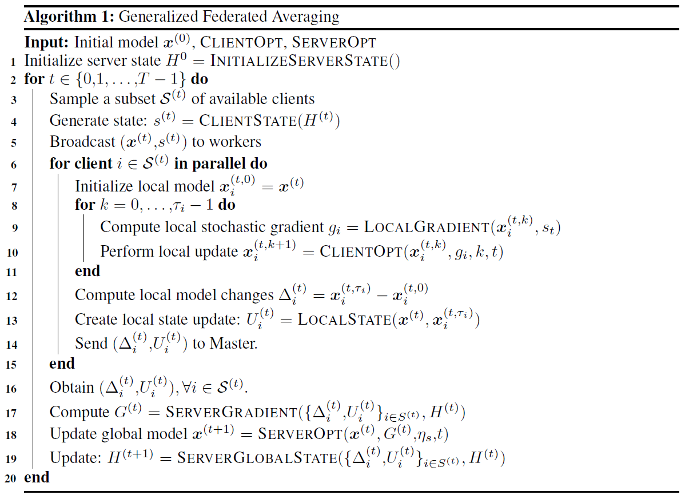
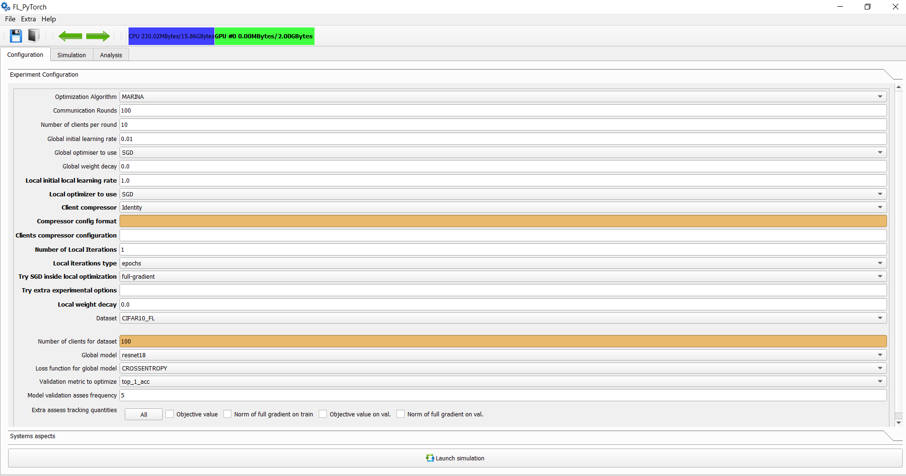
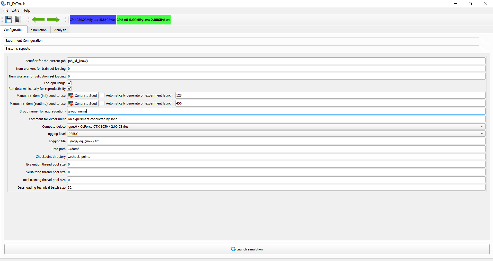
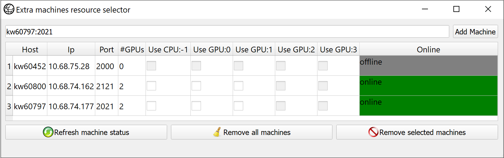
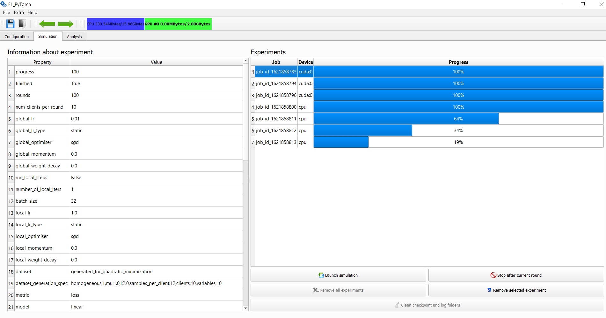

# TUTORIAL

# Table of Content

- [FL_PyTorch](#fl-pytorch)
- [Launch Unit Tests](#launch-unit-tests)
- [Usage of GUI Tool](#usage-of-gui-tool)
  * [Launch GUI Tool](#launch-gui-tool)
  * [Main Screen for Configure Experiment](#main-screen-for-configure-experiment)
  * [System Aspects for Launching an Experiment](#system-aspects-for-launching-an-experiment)
  * [Auxiliary Functionality](#auxiliary-functionality)
    + [Hotkeys](#hotkeys)
    + [Extra. Multi Machine Setup](#extra-multi-machine-setup)
    + [Extra. LogWindow](#extra-logwindow)
    + [Extra. The GUI settings.](#extra-the-gui-settings)
    + [Results of the Simulation](#results-of-the-simulation)
  * [Simulation Tab](#simulation-tab)
  * [Analysis Tab](#analysis-tab)
  * [Dataset Generation](#dataset-generation)
- [How to add Custom Parameters and Comment for Experiment](#how-to-add-custom-parameters-and-comment-for-experiment)
- [How to add Your Compressor](#how-to-add-your-compressor)
- [How to Add Own Optimization Algorithm](#how-to-add-own-optimization-algorithm)
- [How to Add Custom Dataset in HDF5 Format](#how-to-add-custom-dataset-in-hdf5-format)
- [How to Add Custom Dataset, not in HDF5 Format](#how-to-add-custom-dataset--not-in-hdf5-format)
- [Appending Custom Prediction Model](#appending-custom-prediction-model)
- [About Available Scripts](#about-available-scripts)
- [About the License](#about-the-license)


# FL_PyTorch

FL_PyTorch is a software suite based on [PyTorch](https://pytorch.org/) to support efficient simulated Federated Learning experiments. 
The **first step** is to install all required prerequisite software mentioned in [README.md](README.md), and **second step** read this [TUTORIAL.md](TUTORIAL.md ).

FL_PyTorch supports optimization algorithms that can be cast into the form of Algorithm 1 from our paper:


It provides customization at both the experiments and algorithms at different levels:

Several standard algorithms are already implemented (GradSkip, FedAvg, DCGD, SCAFFOLD, FexProx, MARINA, DIANA, FRECON, COFIG, PP-MARINA, EF21, EF21-PP), and these can be further customized with the flags in console mode and GUI simulation.
For example, suppose your algorithm has the form of generalized FedAvg, **Algorithm 1**, but it has an internal custom mechanism for exotic control. In that case, you can append optimization algorithms in the same way as other algorithms that were implemented. Furthermore, a special step-by-step tutorial is presented at the end of the section.
If your algorithms need a unique option that does not cover the presented interface, we have an extra option for passing experiment configuration.

You can carry synthetic experiments or small dimension experiments in the CPU. However, we recommend using a GPU in your target machine to save your time in carrying out high-dimensional experiments.

The simplest way to start working with the system is to use the GUI tool.

---

# Launch Unit Tests

We are targetting to cover more code with unit tests. For the unit tests, we're using [pytest](https://docs.pytest.org/en/stable/getting-started.html), 
which is a framework that makes building simple and scalable tests easy. To launch the unit tests, please do the following step:

```bash
cd ./fl_pytorch/fl_pytorch/scripts 
./launch_unit_tests.sh
```

# Usage of GUI Tool

## Launch GUI Tool

GUI tool is written in PyQt. After activating your Conda or virtualenv environment in Python, you can launch the GUI tool via the following command:
```bash
cd ./fl_pytorch/fl_pytorch/gui
./start.sh
```
Or alternatively, if you don't have a bash interpreter in your system:
```bash
cd ./fl_pytorch/fl_pytorch/gui 
python3.9 start.py
```

Another possible scenario:  You have access to the machine in a cluster with dedicated installed GPU/CPU compute resources.
If you don't have root privileges to install the Windows Management system native for OS or provided as VNC server systems like [*tigervncserver*](https://tigervnc.org/), we provide the ability to launch the GUI tool with the following commands and still have GUI support:
```bash
cd ./fl_pytorch/fl_pytorch/gui 
./start_with_vnc.sh
```
To change the listening port, please directly change the *port* parameter inside this bootstrap bash script. To connect remotely for an application instance, please use VNC Viewer in your host machine, e.g. [RealVNC VNC Viewer](https://www.realvnc.com/en/)

## Main Screen for Configure Experiment

After successfully launching the application, the following main screen appears: 



In the main window in the experimental section, you should specify the following options:

Field | Parameter in Alg.1 | Type |Description
--- | --- | --- | --- 
Communication Rounds | **T** | positive integer | Number of communication rounds in the carrying experiment.
The Number of clients per round | **|S^{(t)}|** 
Global initial learning rate | **\mu_{S}** | float | Step size applied at line 18 of Algorithm 1.
Global Optimizer to use | **ServerOpt** | algorithm | Optimizer to use for modifying global model after communication round at Line 18.
Global weight decay | **ServerOpt** | algorithms | Implicit extra objective term in the form "local-weight-decay" times L2 norm square divided by 2 for the local objective function of clients. Affects **ServerOpt** behavior. 
Local initial learning rate | **\mu_{S}** | float | Step size applied at line 10 of Algorithm 1.
Local Optimizer to use | **LocalOpt** | algorithm | Local Optimizer, which should be used at line 10 of Algorithm 1.
Client compressor | **LocalGradient** | algorithm | Optimization algorithms specific option which is used by local gradient evaluation in an optimization algorithm-specific way. GUI provides a hint for parameters in compressor config parameters. 
Clients compressor configuration | **LocalGradient** | algorithm | Options for optimization algorithms. Options can be fractions, probabilities, or fractions of D, where D is the dimension of the problem.
The Number of local iterations | **\tau_{i}** | positive integer | Number of local iterations for which lines 8,9,19 of Algorithm 1 which repeats. 
Local iterations types | Meaning of **\tau_{i}** | epochs or local-steps | When SGN inside Optimizer is full-gradient, then epochs and local-steps mean the same thing.
Try SGD inside local optimizer | **LocalGradient** | algorithm | It's possible to replace full gradient evaluation in **LocalGradient** evaluation with SGD-US, SGD-NICE, or with Iterated Minibatch SGD. Tau parameter specifies the subsample size or in percentages in an absolute integer value.
Try extra experimental options | **LocalGradient** | algorithm | Arbitrarily string of parameters in comma separate format **"key1:value1,key2:value2"**. These parameters are available from "experimental_options". If you don't have value for the parameter - just skip it and provide only keys in the format **"key1,key2:value2,key3"**. All options during optimization algorithm execution are available at **H["execution_context"].experimental_options**. You can use format **"key1:value1;key2:value2"** and the GUI during preprocessing this parameter will automatically convert ";" into ",". The space before or after delimiter <,> and <";"> will be removed during preprocessing of experimental options in GUI. Also you may provide extra experimental options in the following style **"key1=value1,key2=value2"** the GUI will preprocess this string and convert it into **"key1:value1,key2:value2"** 
Local weight decay | **ClientOpt** | algorithms | Implicit extra objective term in the form "local-weight-decay" times L2 norm square divided by 2 for the local objective function of clients. Affects **ClientOpt** behaviour. 
Dataset | **LocalGradient** | samples | Used dataset for train model for Federated Learning. The number of clients is dataset-specific. 
Global model and Loss | **LocalGradient** | model | The type of the parametrized model used by all clients. We provide several models ResNet, VggNet, RNN type model with LSTM. For the purpose of your experiments, you can make a modification at the level of fl_pytorch/models.
Validation metric to optimize | None | enumeration | Type of validation metric used for selecting the best model in the validation set
Model validation frequency | None | positive integer | Validation metrics are calculated at the first and final communication round, and in each round, multiple of the specified frequency
Extra assess tracking quantities | None | enumeration | Extra quantities which are typically needed for experimental sections of the paper. For your comfort, you can push the "All" button, which selects and unselect all.
----

## System Aspects for Launching an Experiment



After specifying in the main window the main experimental parameters, you should, as a next step, move to the system aspects.

Field | Type |Description
--- | --- | --- 
The identifier for the current job | string | Arbitrarily string. The name of the current job. 
Num workers for a train set loading | non-negative integer | Number of workers during data loading for PyTorch DataLoader during working with the train set. Due to the current limitations of PyTorch, we recommend, in the case of using multithreaded implementation, using value 0.
Num workers for the validation set loading | non-negative integer | Number of workers during data loading for PyTorch DataLoader during working with validation set. Due to the current limitations of PyTorch, we recommend in case of using multithreaded implementation, use value 0.
Log GPU usage | flag | Flag specifies that we should track GPU used memory in bytes by rounds in GPU.
Run deterministically for reproducibility | flag | Flag, which specifies that we want to run experiments deterministically
Manual random (init) Seed to use | positive integer | Seed used during model initialization and dataset generation.
Manual random (runtime) seed to use | positive integer | The Seed used for random number generation during the algorithm's running.
Group name (for aggregation) | string | Name of the group which allows group experiments for statistics.
Comment for experiment | string  | Extra arbitrarily comment during transferring experimental results for your peers.
Compute device | enumeration | Define which CPU/GPU runs an experiment.
Logging level | enumeration | The logging level for console logging messages.
Logging file | path string | Name of logging file which will capture logs in the filesystem.
Data path | path string | Folder name with datasets to use.
Checkpoint directory | path string | Directory to persist run metadata.
Evaluation thread pool size | non-negative integer | Thread pool size for performing evaluation checkpoint asynchronously. In case value zero, evaluation functionality will be in the main thread.
Serializing thread pool size | non-negative integer | Thread pool size for performing serialization into filesystem asynchronously. In case the value is zero, evaluation functionality will be in the main thread.
Local training thread pool size | non-negative integer | Perform local training within a pool of threads. Each one executes a sequence of optimization for assigned clients in a serialized way. In case value zero, evaluation functionality will be in the main thread.
Wandb API key | string | To obtain this key, you should (1) register in it  (2) go to [https://wandb.ai/settings](https://wandb.ai/settings) and copy the API key. The URL for experimental results will be serialized in the experimental results \*.bin file.
Wandb Project Name | string | You may want to track different experiments in different projects.
Use pretrained model | flag | For Neural Nets, that flag will imply that models' weights will be initialized in some pretrained way.
Train only last linear layer | flag | For Neural Nets, that flag will imply that only finite l linear layer will be trained, and another part of the computing graph will not be trained.
Turn off Batch Normalization and DropOut | flag | For Neural Nets, that mechanism brings high accuracy but is often a source of problems in multi-node settings. Important to notice that if BN is turned on, then running means and variance and all buffers will be personal for each client, and clients during simulation do not share that information with the master.
Force cleanup PyTorch cache | flag | Force clean GPU PyTorch cache at the end of each communication round used internally by PyTorch. Good to fix fragmentation issues.
----


## Auxiliary Functionality

### Hotkeys

Several hotkeys are available in the GUI tool.

Hot Key | Description
--- | --- |
CTRL-O | Open file with simulation results
CTRL-S | Save all finished experiments in a binary format
CTRL-E | Request and wait to finish all simulation jobs and exit from the application.
F1 | Help window. Information window about the application, git repository, and runtime environment in which the application has been launched
F2 | Open log window with various auxiliary functionality
F3 | Open remote multi-machine setup. Append machines in format <host_name:port>,...
F5 | Start simulation from the Configuration or Simulation tabs
F6 | Next tab in simulation application
F7 | Previous tab in simulation application
F8 | Plot selected graphics
F9 | Update the experiment information table in Simulation tab
----

### Extra. Multi Machine Setup

When selecting a target computing device, you can select: a specific local CPU, local GPU, or several local devices (e.g., several GPUs) for usage. In addition to that, it's possible to leverage remote computing devices.
First in the remote machine the following script should be launched:
```bash
cd ./fl_pytorch/ 
./run.sh --worker-listen-mode 2222
```

This command will instantiate remote workers on the machine in which the script will be executed. After that command, the local remote worker will listen for an input TCP connection in port 2222. 
So please be sure that firewalls/iptables allow incoming TCP connections for a local node.

After you launch all remote clients, you can use GUI to add them manually and select from available machine compute resources that you want to use in master.

The Multi machine selector:



### Extra. LogWindow

The standard console output window provides logging for simulation at the selected verbosity level. The GUI log windows provide extra logging functionality, which is targeted mainly for information requests.

- System Information about the installed and used version of Python interpreter, Operation System
- PyTorch information with a version of supporting GPU, NVIDIA driver version, versions of PyTorch, NumPy, torchvision
Explicitly force the launch garbage collector to obtain back GPU not referenced GPU/CPU memory.
- Force the launching of Garbage Collector (GC) and also make empty PyTorch caches
- Information about used CPU/GPU memory
- Generated command line for finished experiments and current experiments. In single-line format and multi-line command line format.
- Generate text experiment description of current experiment based on GUI

To use this command line, you can use the console interface for the experiment. To observe options for the CLI program, please launch:
```bash
cd ./fl_pytorch/ 
./run.sh --help
```
Provided generated command line optionally should be augmented with the option ```--out``` to provide the system with the file's name for serializing results into the filesystem.

### Extra. The GUI settings.

Please use the "Settings" in the menu bar to specify the font family and size for the whole GUI application. Also, in that place, you can select the style of the GUI interface.

Next, slightly, another setting for GUI is available in Configuration Tab/Graphical user Interface Settings.

---
### Results of the Simulation
During simulation, there are several places of outputs:

1. Standart output of the console in which the program has been launched (stdout). This is dedicated more to system information
2. Result of the simulation can be saved using GUI via selecting file ->Save or via clicking on a *save* icon. This will lead to saving all finished experiments. If you're using CLI, the output binary files should be specified via *--out* command line parameter. The simulation results are in binary format, which is a serialized binary file serialized with **pickle** python library.
3. Some logging information that happens during working with GUI is available at Help->Log Window (or by hotkey F2)
4. Progress of the simulation can be observed in the GUI application in a "Simulation" tab.

After the simulation is finished, it's possible:

1. To load the results of the simulation into the GUI tool and analyze them.
2. It's possible to extract the command line for repeat simulation next time with CLI or modify the command line for the purpose of relaunching an experiment, for example, with a slightly modified command line:

```bash
cd ./fl_pytorch/scripts 
./extract_cmdline_from_bin.py experiment_a.bin experiment_b.bin
```

## Simulation Tab

The simulation tab allows to observe current progress in the form of progress bars for simulation experiments:

- Launch simulation
- Force stop after the current round of all simulations
- Remove all experiments or remove the selected experiment
- Observe the parameters of the planned experiment during its computation

The early stopped simulation results are showing with dark color highlighting. Experiments that are in progress or have been finished are demonstrated with blues color.
The simulation screen display:


## Analysis Tab

The analysis tab allows selecting experiments from finished experiments, and those can be displayed in 2-dimensional plots on one of the canvases.

The user can select the following parameters:

- Default line width
- Default marker size
- Default font sizes
- Specify what part of the experiment description will go into an automatically generated legend
- Select scale for axes

Furthermore, users can:

- Tune plots layout
- Save plots: "pdf" or "png".
- Tune individual plot widths and colors and do another visual-specific configuration.

If some data is not available in the experiment, you will obtain an error message, but the complete list of available quantities for select them for the OX or OY axis. The depicted curve will have a form  (X(r), Y(r)) of parametrized curves with parameter "r" which is the current communication round.data is not available in the experiment, you will obtain an error message, but the complete list of available quantities for select them for the OX or OY axis. The depicted curve will have a form  (X(r), Y(r)) of parametrized curves with parameter "r" which is the current communication round.

- Rounds
- Norm of server stochastic gradient (proxy train)
- Running function value (proxy train)
- Norm of function gradient (train)
- Function value (train)
- Norm of iterate at the round start (train)
- Norm of function gradient (validation)
- Function value (validation)
- Used GPU Memory (Megabytes)
- \# of bits from clients/\#workers
- \# of bits from clients
- Full gradient oracles (train)
- Sample gradient oracles (train)
- Loss (validation)
- Top1 acc (validation)
- Top5 acc (validation)

## Dataset Generation

It's possible to generate dataset in sythetiszed form fi=(1/n_i) * |matmul(Ai,x)-bi|_2^2

If you specify "homogeneous:1" in generation specification, then all fi will 
have a Hessian with lower and upper bound "mu" and "L" respectively. Even more, in that regime, all **fi** will have the same form, and **f**, which is the average of **fi** will have the same form as well.

* 'clients' - specify number of clients, i.e. it's the number of fucntions 'fi'
* 'n_client_samples' - number of train examples pers client, i.e. number of rows in Ai
* 'variables' - dimensionality of optimization variable 'x'

If you specify "homogeneous:0" in generation specification, then all fi will have some distribution.
But Hessian of **f**, which is the average of **fi** will have the uniform spectrum with minimum and maximum eigenvalue **mu** and **L**.

* 'clients' - specify number of clients, i.e. it's the number of fucntions 'fi'
* 'n_client_samples' - number of train examples pers client, i.e. number of rows in Ai
* 'variables' - dimensionality of optimization variable 'x'

----

# How to add Custom Parameters and Comment for Experiment

Suppose you need to append a comment about the experiment. In that case, you can add this comment to the command line via the ```--comment``` option for the command line or via using a dedicated field in "Configuration/System Aspects" while using GUI. This information will be serialized into final binary files with experimental results.
Suppose you need to provide some information for optimization algorithms. In that case, the easiest way is to provide them with ```--algorithm-options``` option for the command line or via the "Try extra experimental options" section in "Configuration/Experiment configuration" during using GUI.

The supported list of format in GUI are following:
- k1=v1, k2=v2
- k1=v1,k2=v2
- k1:v1, k2:v2
- k1:v1,k2:v2
- k1=v1;k2=v2
- k1=v1,k2=v2

So as you see, it is a comma-separated key, value pairs where key and value are separated by equality or semicolumn. For command-line use directly, please use ":" only.

If you don't want to use the key,value pairs, but you want to use flags, then just omit value information, for example:
- k1,k2=v2

In that case value is implicitly assumed to be "True". All options will be stored 
```exec_ctx.experimental_options```, where exec_ctx is ```ExecutionContext```, and it is available in server state through ```H["execution_context"]```

# How to add Your Compressor

1. You can add your logic of compressor in file [fl_pytorch/utils/compressors.py](fl_pytorch/utils/compressors.py). By design, we currently consider a single compressor class that is configured.
2. First step, you declare your compressor type as a member of ```CompressorType```
3. As a second step, you append the logic of compressor initialization.
```python
def initCompressor(compressorCmdLine, D):
  ....
```
   This method should return an initialized compressor, where **D** is the dimension of the problem, and **compressorCmdLine** is the list of compressor parameters, where the first argument in the list is the name compressor.
4. To instantiate your compressor, you should perform switching based on compressor type from the first argument in compressorCmdLine, i.e., compressorCmdLine[0]
5. If your compressor is unbiased, but you want to estimate this numerically to enhance your confidence, please append the checking code into the unit test section. The unit test method for that aspect is:
```Python
def test_unbiasendess():
  ....
```
6. You need to implement ```def makeMyCompressor(...)``` method and call it from ```def initCompressor(...)```
7. If your compressor is stochastic, please use a pseudo-random number generator inside ```def generateCompressPattern(self, rndgen,...)```. In that context ```rndgen``` is a thread-specific NumPy random generator [numpy.random.RandomState](https://numpy.org/doc/1.16/reference/generated/numpy.random.RandomState.html) that provides the ability to sample from various distributions out of the box.
8. Append logic into the method ```compressVector(...)```. At this moment, you should perform compression of the vector of parameters and update ```last_need_to_send_advance``` statistics. 
```Python
    def compressVector(self, x):
        ...
```
9. If you want to integrate your compressor into GUI, there are several steps:

- Open [fl_pytorch/gui/forms/ConfigWidget.ui](fl_pytorch/gui/forms/ConfigWidget.ui) in QtDesigner
- Find combo box control ```cbxClientCompressor``` and add abbreviature of your compressor via making need changes and save ```*.ui``` file
- Open the directory [fl_pytorch/gui/generated]([fl_pytorch/gui/generated) and generate code for GUI via using [fl_pytorch/gui/generated/generate.sh](fl_pytorch/gui/generated/generate.sh) script. The automatically generated code for GUI will be located in that place.
- Please add you compressor type into [fl_pytorch/gui/start.py](fl_pytorch/gui/start.py) with add this information into ```compressorTypes = [...]```. Also, for the purpose of providing a hint for the use of GUI, please describe the specification of the compressor in ```compressorFormats = [...]```
- The type of compressor will automatically be added into the formed command line by GUI

# How to Add Own Optimization Algorithm

1. You can add your logic in file [fl_pytorch/utils/algorithms.py](fl_pytorch/utils/algorithms.py). Write now implementation of all optimization algorithms which implemented as examples presented in that place.
2. Create your class MyOptimizationAlgorithm without any specific base.
3. Now, you need to implement several methods. First of all, you should implement the method
```python
    @staticmethod
    def initializeServerState(args:argparse.Namespace, 
                              model:torch.nn.Module, D:int)->dict:
```
   This method should return a dictionary that initializes the server state. Here **D** is the dimension of the problem, and **model** is constructed and initialized model. Server state automatically will hold the following parameters:
   - Parsed command-line argument
   - Raw command line
   - Reference to execution context, which stores metainformation about execution
   - Total Number of clients
   - Comment for experiment and group name
   - Start iterate x0.
   - Algorithm name
   - Dimension of the optimization problem
   - Number of current communication round
   - Information about client compressor
   - History about client states. This information is used by algorithms that use some memory for previous control or iterates.

4. Next method in your class should be a method
```python
    @staticmethod
    def clientState(H:dict, clientId:int)->dict:
```
   By our design clienState, in fact, is stateless. The client state is instantiated at the beginning of each round for each of the selected clients. You should define client state based on initialized or updated server state H and number of client **clientId**. Client state automatically will hold the following parameters:
   - Reference to server state
   - Name of the optimization algorithm
   - Client-id
   - Weight of the client
   - Number of current communication round
   - Statistics for times and gradient oracles which computed automatically
   - Statistics for sent bits across the network which the author of the optimization algorithm should compute

5. Next method is the main method which evaluates local gradient
```Python
    @staticmethod
    def localGradientEvaluation(client_state: dict,
                             model: torch.nn.Module,
                             dataloader:torch.utils.data.dataloader.DataLoader,
                             criterion: torch.nn.modules.loss._Loss,
                             is_rnn: bool,
                             local_iteration_number: tuple) -> torch.Tensor:
```
   This method should evaluate the local gradient. For computing full-gradient, you have two options: 
   - use the auxiliary method *evaluateGradient(...)*. In that case you will evaluate the gradient for the full dataset
   - use the auxiliary method *evaluateSgd(...)*. In that case, instead of the full gradient for local train samples, you will evaluate the selected variant of SGD in GUI or command line.

   localGradientEvaluation should return a tuple where in the first argument it should contain approximate function value and in the second computed direction. The computed first value will be used only as a proxy value for function value during analysis, and in case of returning an incorrect value, it will not hurt the logic of our framework.

6. Next, you need to implement server gradient evaluation
```python
    @staticmethod
    def serverGradient(clients_responses: utils.buffer.Buffer, 
                       clients: int, 
                       model: torch.nn.Module, 
                       params_current: torch.Tensor, 
                       H: dict) -> torch.Tensor:
```
   Server gradient is the method that estimates the direction of the global server model update, which should return a flat vector with D elements. As input, this function obtains:
   - *clients_responses*. Thread-safe buffer, which may be at the moment of the call, is not filled by all clients. Please use **waitForItem** on it to wait for the response from all clients. After the local gradient has been computed automatically formed client_response will contain a dictionary with:
        - **model** current local model parameters
        - **optimiser** copy of optimizer state
        - **client_id** id of the client from which all information is coming
        - **client_state** is the reference to the client state
   - *clients* is the total number of clients
   - *model* is the instance of the model under which the server operates.
   - *params_current* is the current parameters of the global model. This is a parameter of the global model before the communication round.
   - *H* is the current server state.

7. Finally, you need append logic into the update of the global server state
```python
    @staticmethod
    def serverGlobalStateUpdate(clients_responses:utils.buffer.Buffer, 
                                clients:dict, 
                                model:torch.nn.Module, 
                                paramsPrev:torch.Tensor, 
                                grad_server:torch.Tensor, 
                                H:dict)->dict:
```
   In this method, as input obtains collected and ready-to-use information about **clients_responses** and **clients** in that communication round, no synchronization with the client is needed. Previous global model **paramsPrev** and new model with updated parameters **model**. The **grad_server**  is the vector equal to what you have computed at **serverGradient**.

# How to Add Custom Dataset in HDF5 Format 

- Append URL to the place from which it's possible to download dataset via HTTP/HTTPS GET Request in [fl_pytorch/data_preprocess/h5_tff_dataset.py](fl_pytorch/data_preprocess/h5_tff_dataset.py).
- After that, you need to create a derived class from H5TFFDataset similar to class FLCifar100 in [fl_pytorch/data_preprocess/fl_datasets/cifar100.py](fl_pytorch/data_preprocess/fl_datasets/cifar100.py).
- Append need logic to reference your dataset by name in [fl_pytorch/data_preprocess/data_loader.py](fl_pytorch/data_preprocess/data_loader.py).
- Append information about a number of the clients and classes in your data set in [fl_pytorch/data_preprocess/data_loader.py](fl_pytorch/data_preprocess/data_loader.py).
- For purpose of having support in GUI please modify *cbxDataset* in [fl_pytorch/gui/forms/ConfigWidget.ui](fl_pytorch/gui/forms/ConfigWidget.ui).

# How to Add Custom Dataset, not in HDF5 Format

If your dataset is not in HDF5 format, you will need to implement more logic.
First of all, you should derive from FLDataset [fl_pytorch/data_preprocess/fl_dataset.py](fl_pytorch/data_preprocess/fl_dataset.py) base class for Federated Learning datasets which obey general principles of PyTorch Dataset, but in addition, it contains two methods:

- **load_data** That method allows deferred data loading into the CPU (host) memory, and it may be helpful in the case of sharing some data with clients. We provide some means of caching mechanism in [fl_pytorch/data_preprocess/read_file_cache.py](fl_pytorch/data_preprocess/read_file_cache.py).
- **set_client(i)**.  API from outside that informs the dataset the next fetching will be on behalf of client i.
- The next steps are the same as steps (3,4,5) for the HDF5 dataset scenario.

# Appending Custom Prediction Model

We provide several referenced models, but you can create your own via computational models. For that purpose, you should use PyTorch to define your model, an instance of the class explicitly or implicitly derived from **torch.nn.Module**.

Because we care about reproducibility, please use pseudorandom generators from **exeuction_context**. If your model contains randomness as a part of computation (e.g., Variational Auto Encoders(VAE) contains that). 
There is no restriction, and you can use any PyTorch, Numpy, Python random generators during models instantiating as an exception.

After creating your model, you should conditionally instantiate your model inside **initialise_model** [fl_pytorch/fl_pytorch/utils/model_funcs.py](fl_pytorch/fl_pytorch/utils/model_funcs.py).

Finally for having GUI support for your models you can append model into **cbxGlobalModel** [fl_pytorch/fl_pytorch/gui/forms/ConfigWidget.ui](fl_pytorch/fl_pytorch/gui/forms/ConfigWidget.ui).

# About Available Scripts

The scripts mainly work with a file that stores the results of experiments. During simulation, the experiment backups are located inside the specified folder with "checkpoints".

There are three ways to obtain that file:  you explicitly save it from the GUI interface, or you specify binary filename via `--out` command line parameter, and only in last place in case you have lost your experiments, please check inside checkpoints directory.

Script | Description
--- | --- |
[fl_pytorch/scripts/dump_configuration.py](fl_pytorch/scripts/dump_configuration.py)  | Dump some information about the experiment from parsing a binary serialized file with experiments.
[fl_pytorch/scripts/dump_quality.py](fl_pytorch/scripts/dump_quality.py)  | Dump only information about evaluation metrics from experiments inside the file with experiments.
[fl_pytorch/scripts/extract_cmdline_from_bin.py](fl_pytorch/scripts/extract_cmdline_from_bin.py)  | Extract a single exact command line parameter from the binary file.
[fl_pytorch/scripts/extract_cmdline_from_bin_nice.py](fl_pytorch/scripts/extract_cmdline_from_bin_nice.py)  | Extract command line parameters from the binary file but that contains each parameter in a separate line for an easy read.
[fl_pytorch/scripts/prune_from_tensors.py](fl_pytorch/scripts/prune_from_tensors.py)  | Perform pruning from any tensors algorithms specific client states. No need to use it. The final pruning is performed after finishing the optimization.
[fl_pytorch/scripts/stats_from_cui_stdout.py](fl_pytorch/scripts/stats_from_cui_stdout.py)  | Parse logs.
[fl_pytorch/scripts/clean_checkpoints.sh](fl_pytorch/scripts/clean_checkpoints.sh)  | Remove any checkpoints.
[fl_pytorch/scripts/launch_unit_tests.sh](fl_pytorch/scripts/launch_unit_tests.sh)  | Launch Unit Tests.
[fl_pytorch/scripts/worker.sh](fl_pytorch/scripts/worker.sh)  | Launch Remote Worker.
[fl_pytorch/scripts/generate_slurm_scripts.sh](fl_pytorch/scripts/generate_slurm_scripts.sh) | That scripts after providing for it name of file with generated single command line will generate you [SLURM](https://slurm.schedmd.com/documentation.html) job description.
----

# About the License

The project is distributed under [Apache 2.0 license](LICENSE).
